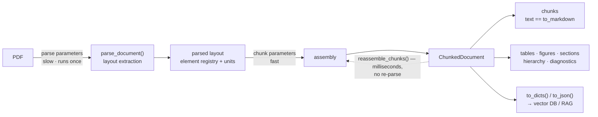

# Layout-Aware Chunking API

`pymupdf4llm.to_chunks()` splits a PDF into retrieval-friendly chunks using
PDF-native layout signals (box boundaries, font changes, vertical gaps, page
breaks) and returns a `ChunkedDocument` — a sequence of chunks plus the
document's structure: an element registry, table/figure/section views, a
section hierarchy, and ingestion diagnostics.

Chunk text is the **same markdown** `to_markdown()` emits for the same
boxes (rendered through the same renderers), so chunks never carry glued
words the renderer would have spaced correctly — a direct hit on
keyword-search recall (BM25 and similar): a term glued to its neighbor
is a term your keyword index cannot match.

Every Python block in this document runs as-is from the repository root
against PDFs shipped with the repository; `tests/test_chunking_docs.py`
executes them in order.

## Quick Start

```python
import pymupdf4llm

cd = pymupdf4llm.to_chunks("examples/country-capitals/national-capitals.pdf")

for c in cd:
    print(c.id, c.metadata.types, c.text.splitlines()[0])
# -> c0 ['heading', 'paragraph', 'table'] # **World Capital Cities**
#    c1 ['table'] |**Country**|**Capital**|**Population**|**%**|**Year**|
#    ...
```

## Two Ways to Call

```python
# 1. One-step: file path or pymupdf.Document
cd = pymupdf4llm.to_chunks("examples/country-capitals/national-capitals.pdf",
                           max_tokens=400)

# 2. Two-step: parse first, then chunk
from pymupdf4llm.helpers.document_layout import parse_document

doc = parse_document("examples/country-capitals/national-capitals.pdf")
cd = doc.to_chunks(max_tokens=400)
```

The one-step form accepts both parse and chunk parameters; they are split
internally by the `parse_document` signature. Unknown chunking parameters
raise `TypeError`.

## At a Glance

One slow layout extraction feeds one reusable set of parsed layout
data; everything
downstream — assembly, views, exports, re-chunking — is cheap:



The two parameter tiers below map onto the two arrows: parse parameters
change the parsed layout (re-parse required), chunk parameters only change
assembly (`reassemble_chunks()` is enough).

Assembly itself works in stages. Layout signals (box boundaries, box
classes, font changes, vertical gaps, page breaks) first propose cut
points; the resulting chunks are then refined in three passes:

1. **Split**: break oversized chunks at sentence boundaries.
2. **Semantic merge**: rejoin a heading with the content that follows it,
   and a caption with its figure or table.
3. **Budget merge**: greedily combine neighbouring chunks while the result
   stays within `max_tokens`. A section-opening chunk never merges
   backward into the previous section (`respect_section_starts=True`).

The semantic merge is what keeps a heading from being stranded at the end
of one chunk with its paragraph in the next, and a caption from being
separated from its figure or table. These are internal stages of
`to_chunks()` and `reassemble_chunks()`, not public methods; the chunk
parameters below are how you steer them.

## Parameters

### Parse Parameters

Passed to `parse_document()` internally.

| Parameter | Default | Description |
|---|---|---|
| `pages` | `None` | Pages to process (`None`=all, or list of 0-based page numbers) |
| `dpi` / `image_dpi` | `150` | Image extraction DPI |
| `ocr_dpi` | `150` | OCR DPI |
| `use_ocr` | (select) | OCR mode |
| `force_ocr` | `False` | Force OCR on all pages |
| `ocr_language` | `"eng"` | OCR language |
| `table_output` | `"markdown"` | `"html"` opts into the engine HTML table model (like `to_markdown`); needs a PyMuPDF with the layout-union table model, degrades to markdown tables with a warning otherwise. Changes `TableChunk` content (see Views) and re-splits boxes (see IDs) |
| `edge_threshold` | `None` | Layout GNN edge-probability cut for box grouping (engine default 0.55; lower merges more, higher fragments more) |
| `show_progress` | `False` | Show progress bar |

`table_output` and `edge_threshold` change the parsed layout itself, so
`reassemble_chunks()` rejects them; re-parse via `to_chunks()` to change
them.

### Chunk Parameters

| Parameter | Default | Description |
|---|---|---|
| `max_tokens` | `400` | Target tokens per chunk. The default is a starting point sized for common embedding inputs; larger budgets are typical for long-context synthesis or section-shaped retrieval — compare sizes with recipe 5 and check final inputs against your model's tokenizer |
| `min_tokens` | `120` | Budget-merge floor: neighbouring chunks combine only while one of them is below this size. `0` disables the floor; `min_tokens=max_tokens` packs greedily up to the budget |
| `breakpoint_threshold` | `0.5` | Boundary score threshold for splitting |
| `merge_small_chunks` | `True` | Merge undersized chunks with neighbors |
| `table_mode` | `"preserve"` | `"preserve"`: table = one chunk; `"isolate"`: tables never budget-merge |
| `respect_section_starts` | `True` | Never budget-merge a section-opening chunk into the previous section's tail — chunk boundaries respect detected headings. Set `False` for pure token packing |
| `header_footer_mode` | `"exclude"` | `"exclude"` / `"auto"` (repeat detection) / `"include"` |
| `sentence_splitter` | `"default"` | `"default"` (English) or `"multilingual"` (CJK support) |
| `tokenizer` | `None` | tiktoken encoding name (unknown names raise `ValueError`), a `callable(text) -> int`, or `None` (character estimate) |
| `weights` | `None` | Boundary-score weight overrides |

Whether `tagged_content` is included in exports is decided at export
time: `ChunkedDocument.to_dicts()` / `.to_json()` take a keyword-only
`include_tagged` (default `True`).

### Choosing a budget

The 400-token default is a starting point, not a recommendation for
every task: published chunking ablations (Chroma, *Evaluating Chunking
Strategies*; NVIDIA, *Finding the Best Chunking Strategy*, 2025) place
useful sizes for retrieval roughly between ~200 and ~1024 tokens
depending on the task and the embedding model, and report that
structure-aware boundaries matter more than the exact number. On
layout-rich documents most chunk boundaries here come from headings,
tables, and boxes rather than from the budget cap. Evaluate candidate
sizes on your own corpus and retrieval task; `reassemble_chunks()`
exists so that comparison costs seconds instead of a re-parse (recipes
5 and 6).

## IDs Are a Contract

Every id format is stable across versions:

| Kind | Format | Example |
|---|---|---|
| chunk | `c{n}` | `c12` |
| table | `t{n}` | `t0` |
| figure | `f{n}` | `f3` (same `n` as `[Figure f3: WxH]` placeholders) |
| section | `s{n}` | `s2` |
| element | `p{page}.b{box}` | `p5.b7` (1-based page, 0-based box) |

**Scope**: element ids are stable for the same *(document bytes, package
version, parse options)*. Parse modes that re-split boxes (e.g. HTML
table rendering) change box indices — never cache ids across parse-option
changes.

**Chunk ids are positions.** `c{n}` is the n-th chunk in reading order, so
`cd.get("c3") is cd[3]`. They are local to one `ChunkedDocument`: a
`reassemble_chunks()` result numbers its own chunks from `c0` again.
Table, figure, section and element ids do not depend on the budget.

`cd.get(id)` resolves any of these; raises `KeyError` for an unknown id
unless you pass `default=`.

## ChunkedDocument

`to_chunks()` returns a `ChunkedDocument`. It is a `Sequence[Chunk]` in
reading order with the document structure attached:

```python
cd = pymupdf4llm.to_chunks("examples/country-capitals/national-capitals.pdf")

# Chunks: a sequence in reading order
len(cd)                        # 6
cd[0], cd[2:5]                 # a Chunk, a list of Chunks
cd.index(cd[3])                # 3 (Sequence protocol: iteration, slicing, index)
cd.chunks                      # the same chunks as a tuple
cd.text                        # all chunk text joined (lazy)

# Structure
cd.elements                    # every layout box, header/footer included (Element)
cd.tables                      # list[TableChunk]   (see Views)
cd.figures                     # list[FigureChunk]
cd.sections                    # list[SectionChunk]
cd.hierarchy                   # sections as a SectionNode tree (root level 0)
cd.get("c0")                   # any public id: c{n}, t{n}, f{n}, s{n}, p{page}.b{box}
cd.get("t0"), cd.get("s0"), cd.get("p1.b0")
cd.get("nope", default=None)   # KeyError without default=

# Exports (JSON-safe; content_hash included)
cd.to_dicts()                  # list[dict], schema below
cd.to_json(indent=2)           # json.dumps(cd.to_dicts()); extra kwargs go to json.dumps
cd.to_dicts(include_tagged=False)   # drop tagged_content from the payload
# Framework exports need optional dependencies (recipe 7):
#   cd.to_langchain_documents()   -> list[langchain_core.documents.Document]
#   cd.to_llama_nodes()           -> list[llama_index.core.schema.TextNode]

# Re-chunking, diagnostics, provenance
cd.reassemble_chunks(max_tokens=200)   # new ChunkedDocument from retained units, no re-parse
cd.diagnostics                 # extraction checks before indexing (keys below)
cd.params                      # read-only mapping of the parameters cd was built with
```

`reassemble_chunks()` accepts assembly-tier parameters only (`max_tokens`,
`min_tokens`, `breakpoint_threshold`, `table_mode`, `merge_small_chunks`,
`respect_section_starts`). The remaining parameters (`sentence_splitter`,
`header_footer_mode`, `tokenizer`, `weights`) and parse options change
the parsed layout data itself and raise `ValueError` — call `to_chunks()`
on a new parse instead. It returns a new `ChunkedDocument`; the original
is unchanged.

### Chunk

```text
Chunk:
    id: str                    # "c0", "c1", ... (position in this ChunkedDocument)
    text: str                  # markdown, identical to to_markdown's rendering
    tagged_content: str       # text with [Section], [Page], [Type] tags (format below)
    content_hash: str          # lazy sha256 of whitespace-normalized text
    metadata: ChunkMetadata
```

### ChunkMetadata

```text
ChunkMetadata:
    page_start, page_end: int  # 1-based original page numbers (survive pages=)
    element_ids: list[str]     # ["p1.b0", ...] — evidence addresses
    section_path: list[str]    # citation path = the owning section's path
    section_id: str | None     # innermost section ("s{n}")
    table_ids: list[str]       # tables in this chunk ("t{n}")
    figure_ids: list[str]      # figures in this chunk ("f{n}")
    types: list[str]           # element types present, in order:
                               # "heading", "paragraph", "table", "list", "figure", "caption", ...
    bboxes: list[tuple]        # (page, x0, y0, x1, y1)
    lists: list[dict]          # list groups: {"items": [{text, page, bbox}], "bboxes": [(page, ...)]}
    token_count: int           # per-chunk token count
    ocr: bool                  # True when a source page went through OCR
    file_path, page_count
```

### to_dicts() schema

One dict per chunk; `metadata` carries every `ChunkMetadata` field as-is:

```text
{
    "id": "c0",
    "text": "...",
    "content_hash": "6adc89bf...",
    "tagged_content": "...",          # omitted with include_tagged=False
    "metadata": {
        "page_start": 1, "page_end": 1, "bboxes": [...],
        "types": ["heading", "paragraph", "table"],
        "section_id": "s0", "section_path": ["World Capital Cities"],
        "token_count": 351, "element_ids": ["p1.b0", "p1.b1", "p1.b2"],
        "table_ids": ["t0"], "figure_ids": [], "lists": [], "ocr": false,
        "file_path": "...", "page_count": 6
    }
}
```

### diagnostics

`cd.diagnostics` reports facts about the parse so you can check
extraction results before indexing; your pipeline owns the thresholds
(recipe 2). Values shown are for the example document:

```text
{
    "chunk_count": 6, "element_count": 14, "table_count": 6, "figure_count": 0,
    "section_count": 1, "page_count": 6,
    "pages_without_chunks": [],      # 1-based pages no chunk covers
    "zero_chunk_causes": [],         # only when chunk_count == 0: "no_text_extracted",
                                     # "all_units_header_footer" or "all_units_filtered"
    "figures_without_text": [],      # figure ids with no extractable text (OCR candidates)
    "degenerate_tables": [],         # table ids whose rendering is empty
    "header_footer_excluded": 6      # units dropped by header_footer_mode
}
```

### Views

`cd.tables`, `cd.figures` and `cd.sections` are lists of these objects;
each links back to the chunk that holds it (`chunk_id`), and the chunk
links forward via `metadata.table_ids` / `figure_ids` / `section_id`:

```text
TableChunk:   id                # "t{n}"
              chunk_id          # id of the chunk holding this table ("c{n}")
              element_id, page, bbox
              markdown | html   # mutually exclusive by parse mode
              headers           # header cell texts from <th>; [] on markdown parses
              caption, caption_element_id
              section_id        # innermost section ("s{n}")
              token_count
              text              # canonical rendering for the parse mode

FigureChunk:  id                # "f{n}"
              chunk_id          # id of the chunk holding this figure
              element_id, page, bbox, boxclass
              ocr_text          # extracted text; None → OCR candidate
              placeholder       # "[Figure f{n}: WxH]" when there's no text
              caption, caption_element_id
              section_id        # innermost section ("s{n}")
              image             # bytes when extract_images=True
              has_text          # bool(ocr_text and ocr_text.strip())

SectionChunk: id                # "s{n}"
              title, level, page_start, page_end
              heading_element_id
              path              # titles, root → self
              element_span      # [start, end) into ChunkedDocument.elements
              child_chunk_ids   # chunks under this section, subtree included
              token_count       # sum over child chunks
              text              # lazy, assembled from the element registry
```

`TableChunk.markdown` is never backfilled with HTML: in HTML table mode
the parser carries `markdown=None` and `html` is canonical; on markdown
parses `html is None` and `headers == []` (header identity comes only
from the engine's `<th>`, never from local heuristics).

**Sections have a single source of truth**: the layout-detected heading
boxes (`section-header`/`title`). The `sections` view, `hierarchy`, and
`chunk.metadata.section_path` (= the innermost owning section's `path`)
all derive from that same heading walk — the PDF TOC is never consulted,
so a document without bookmarks still gets a fully populated
`section_path`, always consistent with the views. Chunk boundaries also
respect this structure: with `respect_section_starts=True` (default) a
section-opening chunk is never budget-merged into the previous section's
tail.

**Sections nest.** `SectionChunk.level` is the engine's font-statistics
heading level — the same value the renderers use for `#`/`##`/`###`
depth — so big headings contain small ones: a level-4 section's `path`
carries all its ancestors, and `cd.hierarchy` exposes the same nesting
as a `SectionNode` tree (root level 0). The section tree therefore
always matches the heading depth visible in the rendered markdown.

A real document makes the ownership rules concrete. `tests/test_370.pdf`
is a five-page paper with nested headings; `own` = chunks whose
`section_id` is this section, `subtree` = the rollup over the section and
everything nested under it:

```python
cd_p = pymupdf4llm.to_chunks("tests/test_370.pdf")
own = {}
for c in cd_p:
    own.setdefault(c.metadata.section_id, []).append(c.id)
for s in cd_p.sections:
    print("   " * (s.level - 1) + f"{s.id} L{s.level} {s.title[:22]!r}",
          f"own={own.get(s.id, [])}",
          f"subtree={len(s.child_chunk_ids)}ch/{s.token_count}tok")
```

```text
s0 L1 'Synthesis of Silyl Die' own=['c0'] subtree=22ch/4711tok
   s1 L2 'Masahiro Sai' own=['c1', 'c2', 'c3', 'c4', 'c5', 'c6', 'c7', 'c8', 'c9', 'c10', 'c11'] subtree=21ch/4688tok
      s2 L3 'AUTHOR INFORMATION' own=['c12'] subtree=3ch/43tok
         s3 L4 'Corresponding Author' own=['c13'] subtree=1ch/21tok
         s4 L4 'Notes' own=['c14'] subtree=1ch/16tok
      s5 L3 'ACKNOWLEDGMENT' own=['c15'] subtree=1ch/24tok
      s6 L3 'REFERENCES' own=['c16', 'c17', 'c18', 'c19', 'c20', 'c21'] subtree=6ch/1637tok
```

`s5` shows the stack popping back: after the level-4 `Notes`, a level-3
heading closes both `s4` and `s2` and becomes a sibling of `s2`.

- **Ownership is innermost.** Content attaches at whatever depth it
  appears: the `Corresponding Author` heading and the e-mail line under
  it form chunk `c13` with `section_id="s3"` and
  `section_path=[..., "AUTHOR INFORMATION", "Corresponding Author"]`,
  one unambiguous address per chunk.
- **Heading-only sections** still exist in the tree, owning just their
  own heading chunk (`s2` owns `c12`, the 6-token `### **AUTHOR
  INFORMATION**` line) until a same-or-shallower heading closes them;
  the content lives in the child sections `s3` and `s4`.
- **Ancestors aggregate.** `child_chunk_ids` and `token_count` cover the
  whole subtree (`s2` rolls up `["c12", "c13", "c14"]`, 43 tokens), and
  `element_span`s nest: `s2` `(34, 39)` contains `s3` `(35, 37)`. Feed a
  whole branch to an LLM via `SectionChunk.text` (recipe 6).
- **Before the first heading**, chunks stay unowned: `section_id=None`,
  `section_path=[]` (a cover-page figure, for instance; a document with
  no headings at all, such as `tests/test_sce_150_1.pdf`, has
  `cd.sections == []` and every chunk unowned).

## Cookbook

These examples show how to prepare chunks for search, inspect extraction
results, and add context to search results. Run the setup below from the
repository root before using a recipe. Each recipe then stands on its own.
Recipe 7 also requires the framework packages it uses.

The examples build ordinary Python dictionaries and lists. Connect these
to your own embedding model, search index, or application as needed.

```python
from pathlib import Path
from hashlib import sha256

import pymupdf4llm

pdf_path = "examples/country-capitals/national-capitals.pdf"
cd = pymupdf4llm.to_chunks(pdf_path, max_tokens=400)
```

### 1. Prepare chunks for indexing

Use `chunk.text` for the extracted Markdown. Use `chunk.tagged_content`
when you also want section titles, page numbers, and content types in
the text sent to your embedding model. Choose the input that works best
for your retrieval task, and apply any formatting your model requires.

Chunk IDs such as `c0` belong to one `ChunkedDocument`. For a shared
index, combine them with a document ID, document version, and processing
version. The processing version should identify the package versions,
parse options, chunk settings, and embedding setup you used.

```python
document_id = "national-capitals"
document_version = sha256(Path(pdf_path).read_bytes()).hexdigest()
index_version = "layout-400-v1"        # your processing configuration version
embedding_config = "my-model-v1"      # include model and input-format settings

records = {}
for chunk, payload in zip(cd, cd.to_dicts()):
    record_id = f"{document_id}:{document_version}:{index_version}:{chunk.id}"
    embedding_text = chunk.tagged_content
    records[record_id] = {
        **payload,
        "embedding_text": embedding_text,
        "embedding_config": embedding_config,
        "embedding_input_hash": sha256(embedding_text.encode("utf-8")).hexdigest(),
        "citation": {
            "section": " > ".join(chunk.metadata.section_path),
            "pages": [chunk.metadata.page_start, chunk.metadata.page_end],
        },
    }

print(len(records))
```

Send each record's `embedding_text` to your model, then save the returned
vector with the record's ID and metadata. Adding a record with an existing
ID should replace that record. Some databases call this operation `upsert`.

To reuse an existing embedding, compare both `embedding_config` and
`embedding_input_hash` with the values saved previously. Hash the exact
text sent to the model, after adding any required prefix or other formatting.
`chunk.content_hash` covers only whitespace-normalized `chunk.text`, so it
does not detect changes to the section or page information in
`tagged_content`. Refresh citation metadata even when an embedding is reused.

When replacing a document in your index, also remove its previous records
that are no longer current. Saving new records alone does not remove old
chunks after a document or configuration change. If you retain multiple
versions, search only the version you intend to use.

### 2. Check extraction results before indexing

`cd.diagnostics` lists potential gaps in the extracted content. Use these
details to decide whether to index the document, inspect it, or request OCR.
An empty page or a figure without text may be expected, so adapt the checks
to your documents.

```python
diagnostics = cd.diagnostics

if diagnostics["chunk_count"] == 0:
    print("No chunks to index:", diagnostics["zero_chunk_causes"])
else:
    print("Chunks available:", diagnostics["chunk_count"])

if diagnostics["pages_without_chunks"]:
    print("Check these pages:", diagnostics["pages_without_chunks"])
if diagnostics["degenerate_tables"]:
    print("Check these empty tables:", diagnostics["degenerate_tables"])
if diagnostics["figures_without_text"]:
    print("Figures to consider for OCR:", diagnostics["figures_without_text"])
```

### 3. Retrieve and cite tables and figures

Tables and figures have their own IDs and source locations. This lets you
index a table separately while keeping its surrounding chunk as context,
or locate a figure that may need OCR.

```python
cd_t = pymupdf4llm.to_chunks("tests/test_tablulate_bug.pdf")

table_records = {}
for table in cd_t.tables:
    table_records[table.id] = {
        "text": table.text,
        "headers": table.headers,
        "page": table.page,
        "bbox": table.bbox,
        "context": cd_t.get(table.chunk_id).text,
    }

figures_to_check = [
    {"id": figure.id, "page": figure.page, "bbox": figure.bbox}
    for figure in cd_t.figures
    if not figure.has_text
]

print(table_records.keys())
print(figures_to_check)
```

The IDs in these local dictionaries also need document and version scopes
before being used in a shared index, as in recipe 1.

Use `table_output="html"` when you need HTML table structure, including
merged cells. On a supported engine, `table.text` contains the HTML and
`table.headers` contains any cells detected as headers. Header lists may
still be empty. Engines without HTML table support fall back to Markdown.

```python
cd_h = pymupdf4llm.to_chunks("tests/test_sce_150_1.pdf", table_output="html")
for table in cd_h.tables:
    print(table.id, table.headers, table.text[:100])
```

### 4. Add neighboring chunks to a search result

A `ChunkedDocument` is a sequence in reading order. Given a chunk ID
returned by your search, select nearby chunks to provide more context.
This example uses `c3` as the search result.

```python
hit = cd.get("c3")
position = cd.index(hit)
neighbors = cd[max(0, position - 2):position + 3]
context = "\n\n".join(chunk.text for chunk in neighbors)

print([chunk.id for chunk in neighbors])
print(context[:200])
```

This includes up to two chunks before and after the hit. The slice stops
at the document edges; it may cross section boundaries. Use recipe 6
when you want context from the hit's section instead.

### 5. Compare chunk sizes and expand search results

`reassemble_chunks()` creates new chunks from the layout already extracted.
You can compare sizes without parsing the PDF again. Choose a size based
on your retrieval results and the model's input limit.

```python
for budget in (200, 400, 800):
    candidate = cd.reassemble_chunks(max_tokens=budget)
    largest = max((chunk.metadata.token_count for chunk in candidate), default=0)
    print("Target:", budget, "Chunks:", len(candidate), "Largest:", largest)
```

Token budgets are targets. A preserved table or an indivisible text unit
can exceed the target, and `metadata.token_count` sums the per-unit counts.
Check the final input with your model's tokenizer when enforcing an input
limit, including any context tags you add.

You can also search smaller chunks and use larger chunks for context.
The two results share source element IDs. Find all larger chunks that
share an element with the search result:

```python
larger = cd.reassemble_chunks(max_tokens=1200)
hit = cd.get("c1")                    # an example result from the original index
source_elements = set(hit.metadata.element_ids)

matches = [
    chunk for chunk in larger
    if source_elements.intersection(chunk.metadata.element_ids)
]
context = "\n\n".join(chunk.text for chunk in matches)

print("Search result:", hit.id)
print("Larger chunks:", [chunk.id for chunk in matches])
```

Element IDs identify layout boxes, not individual sentences. A long box
can span several chunks, so the first match may not contain the hit's
text. Collecting all matches avoids that omission, but can produce a
large context. Use neighboring chunks or the owning section when you
need a different expansion rule. Chunk IDs themselves cannot be matched
across sizes because each result starts numbering at `c0`.

### 6. Browse and search by section

Use a larger token budget when you want longer passages. With
`respect_section_starts=True`, the default, a section-opening chunk is
not merged backward into the previous section during the budget merge.

```python
cd_p = pymupdf4llm.to_chunks("tests/test_370.pdf")
longer = cd_p.reassemble_chunks(max_tokens=2000)

chunks_by_section = {}
for chunk in longer:
    chunks_by_section.setdefault(chunk.metadata.section_id, []).append(chunk.id)

print(chunks_by_section)
```

For a section browser or a keyword index, `cd.sections` also provides
complete section text and title paths:

```python
section_records = {
    section.id: {
        "title": section.title,
        "path": " > ".join(section.path),
        "text": section.text,
        "pages": [section.page_start, section.page_end],
    }
    for section in cd_p.sections
}

print(section_records.keys())
```

Section text includes its nested sections. Indexing both a parent and its
children therefore repeats some content; choose the section levels your
application needs. If a section is too long, use its chunks instead of
dropping its content from the index.

To expand a search result to its owning section:

```python
hit = cd_p.get("c11")
section_id = hit.metadata.section_id
section = cd_p.get(section_id) if section_id is not None else None
context = section.text if section is not None else hit.text

print(context[:200])
```

Chunks before the first detected heading, or in documents without detected
headings, have no owning section. Check the final section text against your
model's input limit before using it as context.

### 7. Export to LangChain or LlamaIndex

Install the package for the framework you use, then call its export
method. Pass `doc_id` when the exported objects will share an index with
other documents; exported IDs then become `"{doc_id}:{chunk.id}"`, which
keeps them unique across documents. Without it, IDs are the local chunk
IDs, and two documents both start at `c0`.

```python
# Requires langchain-core.
documents = cd.to_langchain_documents(doc_id="national-capitals")
```

```python
# Requires llama-index-core.
nodes = cd.to_llama_nodes(doc_id="national-capitals")
```

Both methods export `chunk.text` and the fields in `ChunkMetadata`.
They do not use `tagged_content` as the document text. The original
local chunk ID is always available as `metadata["chunk_id"]`, so a
search result maps back to this document through `cd.get()`.

## tagged_content Format

```
[Section] Chapter 1 > Section 1.2
[Page] 5
[Type] heading, table
[Markdown]
{chunk.text}
```

- `[Section]` appears only when `section_path` is non-empty.
- `[Type]` lists `metadata.types` without `"paragraph"`; the line is
  omitted when `"paragraph"` is the only type.

## Token counting

Chunk budgets sum precomputed per-unit token counts (no re-tokenizing of
joined text), so `metadata.token_count` can differ slightly from
tokenizing the final chunk text — budgets are targets, not guarantees.
Pass `tokenizer="cl100k_base"` (tiktoken) or a callable to count with
your own tokenizer; the default is a 4-chars-per-token estimate. An
unknown tiktoken encoding name raises `ValueError` rather than silently
falling back. When enforcing a hard model input limit, tokenize the
exact final input you send, including any tags or prefixes you add.

The resulting total is exposed as `metadata.token_count`, and on the
`TableChunk` / `SectionChunk` views as `token_count`.
